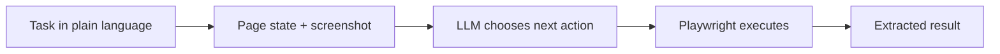

# BrowserBot

**Autonomous browser agent: an LLM decides each step and Playwright navigates, clicks, types and extracts data to complete multi-step web tasks.**

     



## Problem it solves

Many web tasks have no API and break scripted scrapers whenever the page changes. BrowserBot looks at the page, chooses the next action with an LLM and keeps going until the task is done, with screenshots at each step for debugging.

An AI-powered autonomous browser agent that controls a web browser using Playwright, makes decisions using an LLM, and completes multi-step web tasks autonomously.

## Features

- ** AI Decision-Making**: Uses LLM (OpenAI, DeepSeek, OpenRouter, Anthropic) to choose actions
- ** Full Browser Control**: Navigate, click, type, scroll, extract data
- ** Stealth Mode**: Random user agents, viewport randomization, human-like delays
- ** Screenshot Debugging**: See what the agent sees at each step
- ** REST API**: FastAPI server for programmatic access
- ** Session Persistence**: Cookies and state survive between tasks
- ** Task Queue**: Multiple tasks queued and processed sequentially

## Quick Start

### Installation

```bash
pip install -r requirements.txt
playwright install chromium
```

### CLI Usage

```bash
# Run a task
python main.py "Go to example.com and tell me the page title"

# With screenshots
python main.py "Search Google for Python" --screenshots --output ./sessions/

# In visible mode (not headless)
python main.py "Go to wikipedia.org" --visible
```

### API Server

```bash
python api.py --port 8000
```

Submit tasks via API:

```bash
curl -X POST http://localhost:8000/api/v1/tasks \
  -H "Content-Type: application/json" \
  -d '{"goal": "Go to example.com and tell me the page title", "headless": true}'
```

### Docker

```bash
docker-compose up -d
```

## Environment Variables

| Variable | Required | Description |
|----------|----------|-------------|
| `OPENAI_API_KEY` | No | OpenAI API key |
| `ANTHROPIC_API_KEY` | No | Anthropic API key |
| `DEEPSEEK_API_KEY` | No | DeepSeek API key |
| `OPENROUTER_API_KEY` | No | OpenRouter API key |

If no API key is set, BrowserBot runs in **demo mode** with heuristic-based actions.

## Project Structure

```
browser-agent/
├── main.py                 # CLI entry point
├── api.py                  # FastAPI server
├── requirements.txt
├── Dockerfile
├── docker-compose.yml
├── README.md
├── src/
│   ├── engine/             # Core agent loop
│   │   ├── agent.py        # BrowserAgent — observe-think-act loop
│   │   ├── actions.py      # Action executor
│   │   ├── observer.py     # Page observation
│   │   └── session.py      # Session persistence
│   ├── llm/                # LLM integration
│   │   ├── client.py       # Unified LLM client
│   │   ├── prompts.py      # System prompts
│   │   └── parser.py       # Parse LLM responses
│   ├── stealth/            # Anti-detection
│   │   └── config.py       # User agent rotation
│   ├── server/             # API server
│   │   ├── api.py          # FastAPI routes
│   │   ├── models.py       # Pydantic schemas
│   │   └── tasks.py        # Task queue + SQLite
│   └── utils/
│       └── helpers.py      # Formatting utilities
├── tests/
│   ├── test_actions.py
│   └── test_agent.py
└── examples/
    ├── google_search.py
    ├── scrape_product.py
    └── multi_step_form.py
```

## API Endpoints

| Method | Path | Description |
|--------|------|-------------|
| POST | `/api/v1/tasks` | Submit a new task |
| GET | `/api/v1/tasks` | List all tasks |
| GET | `/api/v1/tasks/{id}` | Get task status |
| GET | `/api/v1/tasks/{id}/result` | Get task result with screenshots |
| GET | `/api/v1/health` | Health check |

## License

MIT
